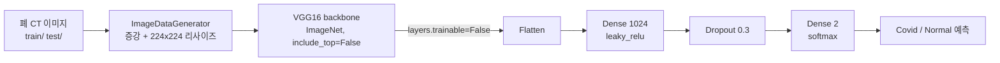
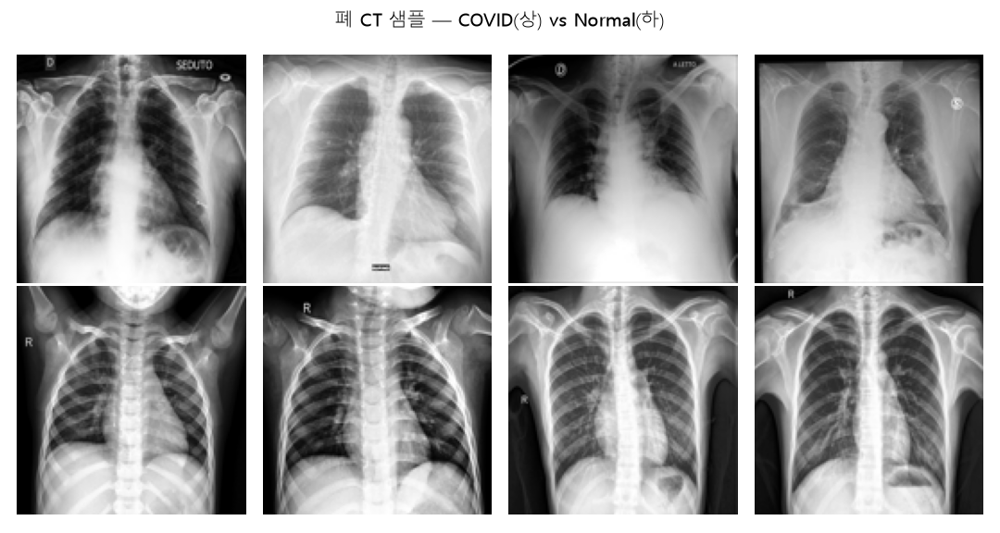
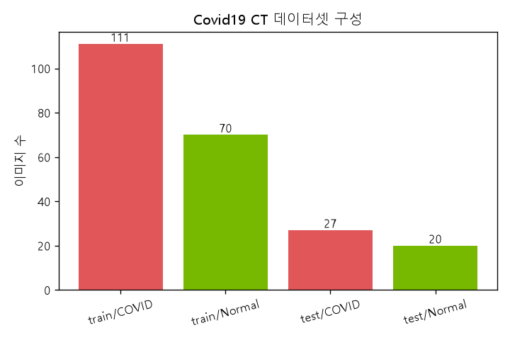

# 폐 CT 이미지 분류 (Lung CT Image Classification)
### VGG16 전이학습 기반 COVID-19 / Normal 분류

> **English summary**
> A medical-imaging classifier that distinguishes **COVID-19** from **Normal** lung CT scans using **transfer learning**. A VGG16 backbone pretrained on ImageNet is used as a frozen feature extractor (`include_top=False`, all convolutional layers non-trainable), and a lightweight custom head (`Flatten → Dense(1024, leaky_relu) → Dropout(0.3) → Dense(2, softmax)`) is trained on top. Because medical CT datasets are small, freezing the pretrained backbone lets the model reuse rich ImageNet features while only the classification head adapts to the CT domain. Aggressive data augmentation (rotation, shifts, flips) further compensates for limited training data. A companion script demonstrates raw VGG16 inference with ImageNet class decoding.


-8A2BE2)


---

## 개요 / 문제 정의

의료 영상 분류는 **데이터가 적고 라벨링 비용이 높다**는 현실적 제약을 안고 있습니다. 이 프로젝트는 그 제약을 **전이학습(Transfer Learning)** 으로 해결합니다.

- **목표**: 폐 CT 이미지를 입력받아 **Covid(0) / Normal(1)** 을 분류
- **핵심 아이디어**: ImageNet으로 사전학습된 VGG16의 특징 추출 능력을 **동결(freeze)** 한 채 재사용하고, 새 분류 헤드만 학습
- **왜 동결하는가**: 학습 데이터가 적을 때 사전학습 가중치를 그대로 얼려 사용하면(코드 주석 명시) 과적합을 줄이고 일반화된 저수준·중수준 시각 특징을 그대로 활용할 수 있음
- **보조 스크립트**: 원본 VGG16(top 포함) 모델로 일반 이미지를 추론하고 ImageNet 라벨을 디코딩하는 예제 포함

## 데이터셋

- **출처/구성**: `Covid19_CT_Image_dataset` — `train/` · `test/` 하위에 클래스별 디렉토리
- **클래스**: `{'Covid': 0, 'Normal': 1}` (2-class, `flow_from_directory` 자동 라벨링)
- **입력 크기**: `224 × 224 × 3` (VGG16 표준 입력)
- **배치 크기**: 4 (소규모 데이터에 맞춘 작은 배치)
- **로딩 방식**: `ImageDataGenerator.flow_from_directory(class_mode='categorical')`

### 데이터 증강 (train 전용)

| 증강 기법 | 설정값 |
|-----------|--------|
| 회전 | `rotation_range=180` |
| 가로 이동 | `width_shift_range=0.2` |
| 세로 이동 | `height_shift_range=0.2` |
| 좌우 반전 | `horizontal_flip=True` |
| 상하 반전 | `vertical_flip=True` |

> 테스트 제너레이터는 증강 없이(`ImageDataGenerator()`) `shuffle=False`로 로딩해 평가 일관성을 유지합니다. CT 영상은 방향성이 강하지 않아 상하·좌우 반전과 큰 회전이 유효한 증강으로 작동합니다.

## 방법론

### 파이프라인



### 모델 아키텍처 (`폐CT_전이학습_분류.py`)

```
VGG16(weights='imagenet', include_top=False, input_shape=(224,224,3))
  └─ 모든 conv 레이어 layer.trainable = False   # 특징 추출기로 동결
Flatten()
Dense(1024, activation='leaky_relu')
Dropout(0.3)
Dense(2, activation='softmax')                  # Covid / Normal
```

- **손실 함수**: `categorical_crossentropy`
- **옵티마이저**: `Adam(learning_rate=1e-5)` — 사전학습 특징을 흔들지 않도록 매우 낮은 학습률
- **에폭**: 최대 30 (조기 종료로 단축)
- **steps_per_epoch / validation_steps**: `ceil(samples / batch_size)` 로 계산
- **콜백**:
 - `ModelCheckpoint('./CT_bestmodel.keras', save_best_only=True)`
 - `EarlyStopping(patience=3, restore_best_weights=True)`

### 보조 스크립트 (`vgg16_model_summary.py`)

- `VGG16()` (top 포함, ImageNet 가중치 전체) 로딩 후 `summary()` 출력
- 테스트 이미지 디렉토리를 순회하며 `load_img → img_to_array → reshape(1,224,224,3) → preprocess_input`
- `predict` 후 `decode_predictions`로 ImageNet 1000-class 라벨 디코딩 → 전이학습 대상 backbone의 원래 능력을 직접 확인하는 데모

## 결과

### 데이터 탐색 (실제 CT 영상)

전이학습에 사용한 실제 Covid19 CT 데이터셋을 시각화한 결과입니다. (`results/`)

| 폐 CT 샘플 — COVID vs Normal | 데이터셋 구성 |
|:---:|:---:|
|  |  |

COVID 폐 CT는 정상 대비 간유리음영(ground-glass opacity) 등 병변 패턴이 관찰됩니다. 데이터가 소규모(train 181장)이고 클래스 불균형(COVID 111 / Normal 70)이 있어 **사전학습 VGG16 전이학습 + 강한 데이터 증강** 전략이 타당함을 뒷받침합니다.

### 모델 학습 산출물

- `CT_bestmodel.keras` — 검증 성능 기준 최적 가중치 스냅샷
- 매 에폭 `train`/`validation`의 `loss`·`accuracy` 로그
- `flow_from_directory`의 `class_indices`(`{'Covid': 0, 'Normal': 1}`) 라벨 매핑 검증

> 위 그림은 `make_figures.py`(PIL+matplotlib)의 실제 출력입니다. 원본 CT 데이터셋은 저장소에 포함하지 않으며(샘플 합성 이미지만), 정확도 수치는 학습 환경에 따라 달라져 표기하지 않습니다.

## 실행 방법

### 1. 데이터 준비

```
Covid19_CT_Image_dataset/
├── train/
│   ├── Covid/    (*.png|*.jpg ...)
│   └── Normal/
└── test/
    ├── Covid/
    └── Normal/
```

### 2. 의존성 설치

```bash
pip install -r requirements.txt
```

### 3. 실행

```bash
# 전이학습 분류 모델 학습
python src/폐CT_전이학습_분류.py

# (선택) VGG16 원본 추론 데모 — ImageNet 라벨 디코딩
python src/vgg16_model_summary.py
```

> 스크립트 내 데이터 경로는 개발 환경 기준 절대 경로(`/home/sckit/...`)입니다. 로컬 데이터 위치에 맞게 `train_dir` / `test_dir` 를 수정하세요. 최초 실행 시 VGG16 ImageNet 가중치가 자동 다운로드됩니다.

## 배운 점

- **전이학습 = 적은 데이터의 해법**: backbone을 동결하면 학습 파라미터가 헤드로 국한되어, 소규모 의료 영상에서도 과적합을 억제하며 학습이 가능합니다.
- **아주 낮은 학습률의 이유**: `1e-5`로 설정해 사전학습된 표현을 무너뜨리지 않고 헤드만 정교하게 맞췄습니다.
- **증강의 도메인 적합성**: CT는 상하·좌우 방향 의미가 약해 큰 회전·양방향 반전이 안전한 증강으로 작동합니다.
- **`include_top=False`의 의미**: FC 분류층을 떼어내고 `Flatten → Dense`로 재설계함으로써 출력 클래스 수(2)와 도메인에 맞는 헤드를 자유롭게 구성하는 법을 익혔습니다.

## 참고

- [`deep-learning-keras`](https://github.com/NvidiaSeoul) — CNN·Keras 모델 설계·콜백의 기초
- ImageNet 사전학습 모델(VGG16)의 원리와 `decode_predictions` 활용은 본 저장소 `vgg16_model_summary.py` 참고
- 시퀀스 데이터 전이/사전학습의 자연어 버전은 [`korean-movie-review-sentiment`](https://github.com/NvidiaSeoul/korean-movie-review-sentiment)의 임베딩 학습과 대비해 보세요

---

> NVIDIA AI Academy Seoul · Cohort 1 포트폴리오의 일부 — [전체 보기](https://github.com/NvidiaSeoul)
